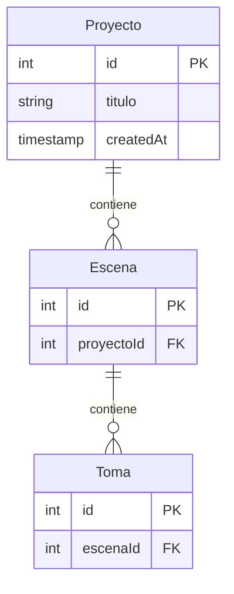

# Entidades de estudio-cine

Mapa vivo del dominio. Lo iremos enriqueciendo conforme afloren campos, relaciones y reglas. Pensado como referencia rápida para diseñar el schema de la DB y los flujos de UI.

## Diagrama

## Relaciones

| Padre    | Hijo   | Cardinalidad | Notas |
| -------- | ------ | ------------ | ----- |
| Proyecto | Escena | 1 : N        | Un proyecto agrupa varias escenas. |
| Escena   | Toma   | 1 : N        | Cada escena se compone de varias tomas. |

## Estado de cada entidad

- **Proyecto** — schema implementado en SQLite ([src/lib/server/db/schema.ts](../src/lib/server/db/schema.ts)). Campos: `id`, `titulo`, `createdAt`.
- **Escena** — pendiente de definir campos.
- **Toma** — pendiente de definir campos.

## Notas

_(Se irán agregando aquí observaciones de dominio: invariantes, atributos no-obvios, reglas de borrado en cascada, etc.)_
