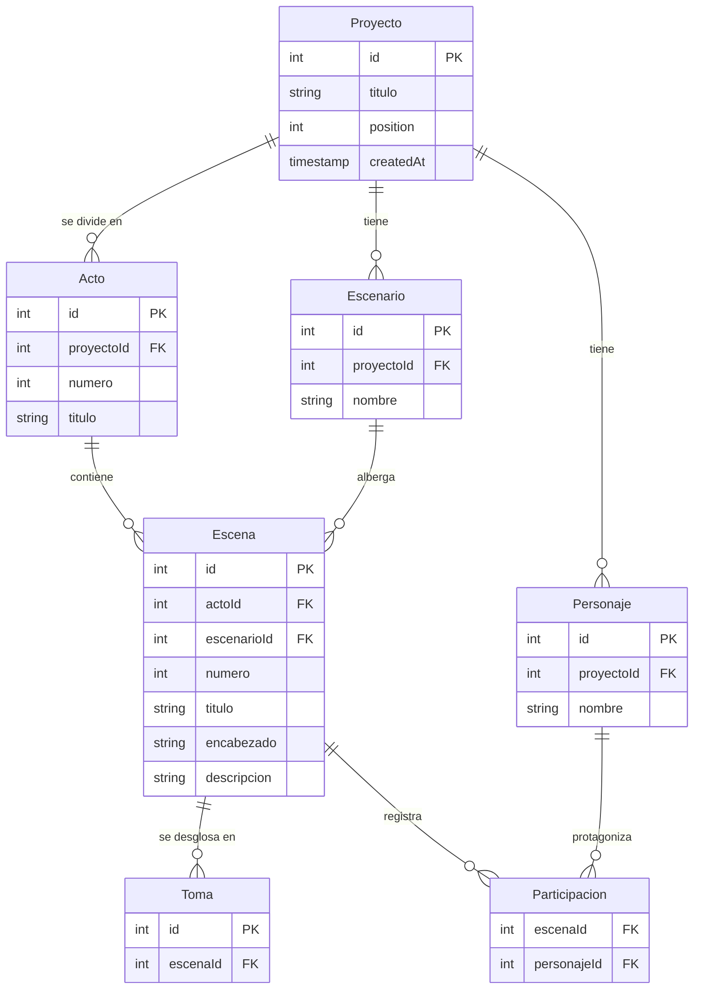

# Entidades de estudio-cine

Mapa vivo del dominio. Lo iremos enriqueciendo conforme afloren campos, relaciones y reglas. Pensado como referencia rápida para diseñar el schema de la DB y los flujos de UI.

## Diagrama

## Relaciones

| Padre     | Hijo          | Cardinalidad | Notas |
| --------- | ------------- | ------------ | ----- |
| Proyecto  | Acto          | 1 : N        | Un proyecto se divide en uno o varios actos (estructura clásica de guion). |
| Proyecto  | Personaje     | 1 : N        | Cada proyecto tiene su propio cast. "PEDRO" en dos guiones distintos son dos `Personaje` diferentes. |
| Proyecto  | Escenario     | 1 : N        | Cada proyecto tiene su propio set de locaciones. |
| Acto      | Escena        | 1 : N        | Cada acto contiene varias escenas, en orden cronológico dentro del acto. |
| Escenario | Escena        | 1 : N        | **Cada escena tiene exactamente UN escenario (solo uno)**, nunca dos. Un mismo escenario puede albergar múltiples escenas. |
| Escena    | Participacion | 1 : N        | Una escena registra varias participaciones — una por cada personaje que aparece en ella. |
| Personaje | Participacion | 1 : N        | Un personaje protagoniza varias participaciones — una por cada escena donde aparece. |
| Escena    | Toma          | 1 : N        | Cada escena se compone de varias tomas (shots individuales). |

### Sobre la tabla `Participacion`

`Participacion` es una **tabla intermedia normalizadora con nombre significativo**. Reemplaza la relación M:N directa entre `Escena` y `Personaje` por una entidad de primera clase: cada fila representa la aparición de UN personaje en UNA escena.

- Composite primary key: `(escenaId, personajeId)` — un personaje no puede aparecer dos veces en la misma escena.
- Cascade en ambos lados: si se borra una escena o un personaje, sus participaciones se borran.
- **Extensible**: al ser entidad con nombre, en el futuro puede llevar atributos propios — minutos en pantalla, número de líneas de diálogo, tipo de aparición (cameo, principal, voz en off), etc. — sin necesidad de migrar a otra estructura.

## Estado de cada entidad

- **Proyecto** — schema implementado en SQLite ([src/lib/server/db/schema.ts](../src/lib/server/db/schema.ts)). Campos: `id`, `titulo`, `position`, `createdAt`.
- **Acto** — schema **implementado** como tabla propia. Campos: `id`, `proyectoId` (FK), `numero`, `titulo`, `createdAt`. Backfill desde columnas legacy `acto_numero`/`acto_titulo` aplicado en migration 0006.
- **Escenario** — schema **implementado** como tabla propia. Campos: `id`, `proyectoId` (FK), `nombre`, `createdAt`. Constraint de unicidad `(proyectoId, nombre)`. La AI emite `escenario` canónico (sin INT/EXT ni tiempo) — distintos slugs del mismo lugar (DÍA/NOCHE) consolidan a un único `Escenario`.
- **Personaje** — schema **implementado** como tabla propia. Campos: `id`, `proyectoId` (FK), `nombre`, `createdAt`. Constraint de unicidad `(proyectoId, nombre)`. La relación con `Escena` se modela a través de `Participacion`.
- **Escena** — schema **implementado** con FKs normalizadas: `actoId` y `escenarioId`. Campos: `id`, `proyectoId` (legacy, conservado), `actoId`, `escenarioId`, `numero`, `titulo`, `encabezado` (slug original como referencia), `descripcion`, `createdAt`. Personajes vía `Participacion`. **Columnas legacy aún presentes** (`personajes` JSON, `actoNumero`, `actoTitulo`) — se siguen poblando por compatibilidad pero no se leen; pendiente migration de cleanup.
- **Participacion** — schema **implementado** como tabla intermedia con nombre. Migración 0007 renombró `escenas_personajes` → `participaciones` preservando los 33 registros y sus FKs.
- **Toma** — pendiente de definir campos y crear schema.

## Notas

- **Numeración de escenas:** global y continua a través de todos los actos del proyecto. Si Acto I termina con escena 7, Acto II arranca con 8 — no se reinicia el contador por acto. Esto evita ambigüedad cuando las escenas viven planas en DB sin contexto de acto.
- **Detección de actos por IA:** el system prompt del builder le indica al modelo que detecte divisiones de acto explícitas en el script (encabezados tipo `ACTO I`, `ACT ONE`, `PARTE 1`). Si el script no las marca, todo se devuelve dentro de un solo acto (`numero: 1`, `titulo: ""`). El modelo no inventa boundaries de acto basados en estructura narrativa cuando no están en la fuente.
- **Cardinalidad escena↔escenario (1:N en lugar de N:M):** convención de cinema — cada escena ocurre en una sola locación; cuando "intercalan" dos lugares, son dos escenas separadas (regla del slug). Por eso `escenarioId` cabe como FK directa en `escenas`, no requiere tabla intermedia.
- **Cardinalidad escena↔personaje (M:N) modelada vía `Participacion`:** una misma escena reúne a varios personajes y un mismo personaje aparece en varias escenas. En lugar de una tabla de unión anónima (`escenas_personajes`), usamos una tabla intermedia con nombre semántico (`participaciones`). Las dos relaciones son 1:N desde sus respectivos lados: Escena 1:N Participacion, Personaje 1:N Participacion.
- **`Participacion` como entidad expandible:** al darle nombre propio (no solo "join table"), si mañana se quiere agregar atributos por aparición — duración, número de diálogos, rol específico en la escena — basta con sumar columnas a esa tabla. Sin esa nominalización, habría que rediseñar.
- **Iteración antes que migración:** estuvimos iterando el shape del JSON antes de comprometer la DB. La normalización completa (tablas `actos`, `personajes`, `escenarios`, FKs en `escenas`, tabla intermedia `participaciones`) ya se aplicó en una pasada coordinada (migrations 0006 y 0007). Las columnas legacy en `escenas` (`personajes` JSON, `actoNumero`, `actoTitulo`) se conservan por ahora como respaldo durante la transición; pendiente cleanup migration cuando la nueva estructura esté validada en uso.
